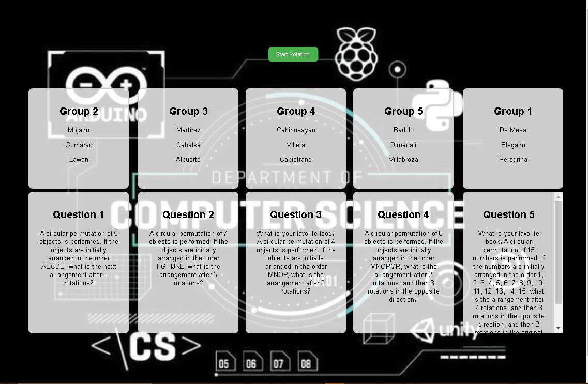

<h1> Group of Student Rotation System Documentation </h1>

<h2> Overview </h2>

 The Circular Rotation System is a web-based application that simulates a circular rotation of groups around a set of tables. The system is designed to demonstrate a circular permutation algorithm, where each group moves to the next table in a circular fashion. 

 It's purpose is to show where a group of students have to answer a one question in a different tables using circulation it will move counter-clockwise until all the group of students have already been on that table 

 The program will tell you that the rotation has started and it will also tell you when the rotation has stopped. 

 In the first rotation, it will read first the program until it count down to the given time every interval of rotation. 

      

 const rotationInterval = 10; 

 In this part of javascript, you can change the time of interval of how many seconds that every group will answer the question 

<h2> System Components </h2>

Tables: The tables are the stationary elements in the system, represented by HTML div elements with classes table1, table2, etc.

Groups: The groups are the moving elements in the system, represented by HTML div elements with classes group1, group2, etc.

Rotation Button: The rotation button is an HTML button element that triggers the rotation of the groups.

<h2> Algorithm </h2>

The circular rotation algorithm used in this system is based on the following formula:

< newIndex = (currentIndex + index) % groups.length >

where:

<ol> newIndex is the new index of the group </ol>
<ol> currentIndex is the current index of the group </ol>
<ol> index is the index of the group in the groups array </ol>
<ol> groups.length is the number of groups in the system </ol>

<h3> This how the rotation works: </h3>

<h2> Code Logic </h2>

<h4> The code logic is as follows: </h4>

1. Initialize the currentGroupIndex variable to 0.
2. Store the left values of the groups in the groupLeftValues array.
3. Define the rotateGroups function, which updates the left values of the groups based on the currentGroupIndex and the groupLeftValues array.
4. Define the startRotation function, which sets the rotation interval using the setInterval function.
5. Add an event listener to the rotation button to trigger the startRotation function.

<h2> Instructions for Running the System </h2>

<h4> To run the system, follow these steps: </h4>

1. Open the HTML file in a web browser.
2. Click the rotation button to start the rotation.
3. The groups will rotate around the tables in a circular fashion.

<h2> CLI Instructions </h2>

<h4> To run the system in CLI format, follow these steps: </h4>

1. Open a terminal or command prompt.
2. Navigate to the directory containing the HTML file.
3. Run the command open index.html (on Mac) or start index.html (on Windows) to open the HTML file in a web browser.
4. Click the rotation button to start the rotation.

<h2> GUI Instructions </h2>

<h4> To run the system in GUI format, follow these steps: </h4>

1. Open the HTML file in a web browser.
2. Click the rotation button to start the rotation.
3. The groups will rotate around the tables in a circular fashion.

<h2> User Interaction </h2>

The user can interact with the system by clicking the rotation button to start or stop the rotation. The user can also adjust the rotation interval by modifying the rotationInterval variable in the code.

<h2> Troubleshooting </h2>

<h4> If the system does not work as expected, check the following: </h4>

1. Ensure that the HTML file is correctly linked to the CSS and JavaScript files.
2. Check that the groupLeftValues array is correctly populated with the left values of the groups.
3. Verify that the rotateGroups function is correctly updating the left values of the groups.

<h2> Conclusion </h2>

The Circular Rotation System is a web-based application that demonstrates a circular permutation algorithm. The system consists of tables and groups that rotate around each other in a circular fashion. The user can interact with the system by clicking the rotation button to start or stop the rotation. The system is designed to be easy to use and understand, with a simple and intuitive interface.
